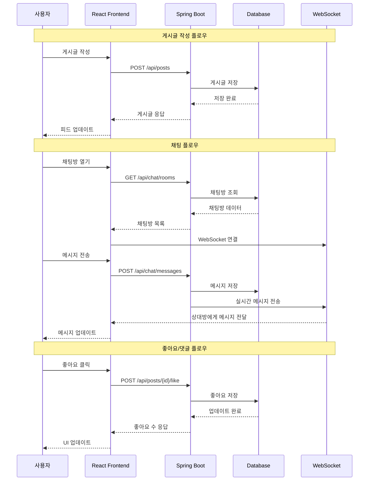

# API 데이터 플로우

## API 엔드포인트 목록

### 게시글 관련
- `GET /api/posts` - 게시글 목록 조회
- `POST /api/posts` - 게시글 작성
- `POST /api/posts/{id}/like` - 좋아요
- `DELETE /api/posts/{id}/like` - 좋아요 취소

### 댓글 관련
- `GET /api/posts/{postId}/comments` - 댓글 목록 조회
- `POST /api/posts/{postId}/comments` - 댓글 작성
- `DELETE /api/comments/{id}` - 댓글 삭제

### 채팅 관련
- `GET /api/chat/rooms` - 채팅방 목록
- `POST /api/chat/rooms` - 채팅방 생성
- `GET /api/chat/rooms/{roomId}/messages` - 메시지 조회
- `POST /api/chat/rooms/{roomId}/messages` - 메시지 전송
- `WebSocket: ws://localhost:8080/ws/chat/{roomId}` - 실시간 채팅

### 인증 관련
- `POST /api/auth/kakao` - 카카오 로그인
- `POST /api/auth/google` - 구글 로그인
- `POST /api/auth/logout` - 로그아웃