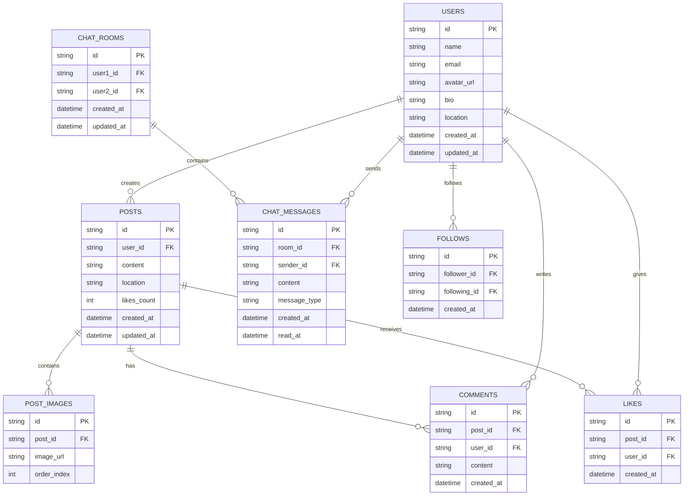

# 데이터베이스 스키마

## 테이블 설명

### USERS
사용자 기본 정보를 저장하는 테이블
- 프로필 사진, 자기소개, 위치 정보 포함

### POSTS
게시글 정보를 저장하는 테이블
- 텍스트 내용, 위치, 좋아요 수 등 포함

### POST_IMAGES
게시글에 첨부된 이미지들을 저장하는 테이블
- 하나의 게시글에 여러 이미지 첨부 가능
- order_index로 이미지 순서 관리

### COMMENTS
게시글에 달린 댓글을 저장하는 테이블

### LIKES
게시글 좋아요 정보를 저장하는 테이블
- 사용자와 게시글 간의 좋아요 관계

### CHAT_ROOMS
1:1 채팅방 정보를 저장하는 테이블
- 두 사용자 간의 채팅방

### CHAT_MESSAGES
채팅 메시지를 저장하는 테이블
- 텍스트, 이미지, 파일 타입 지원
- 읽음 상태 관리

### FOLLOWS
사용자 간 팔로우 관계를 저장하는 테이블
- 팔로워와 팔로잉 관계 관리