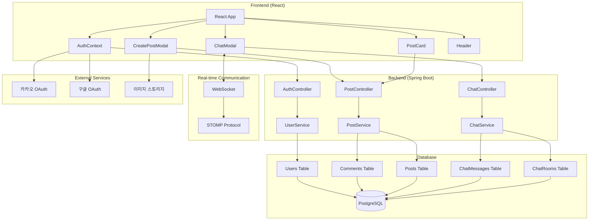

# 시스템 아키텍처 다이어그램

## 구성 요소 설명

### Frontend (React)
- **React App**: 메인 애플리케이션
- **AuthContext**: 인증 상태 관리
- **PostCard**: 게시글 표시 컴포넌트
- **ChatModal**: 채팅 UI 컴포넌트
- **CreatePostModal**: 게시글 작성 모달
- **Header**: 네비게이션 헤더

### Backend (Spring Boot)
- **Controllers**: REST API 엔드포인트
- **Services**: 비즈니스 로직 처리
- **WebSocket**: 실시간 통신

### Database
- **PostgreSQL**: 메인 데이터베이스
- **Tables**: 사용자, 게시글, 댓글, 채팅 데이터

### External Services
- **OAuth**: 소셜 로그인
- **Storage**: 이미지 파일 저장