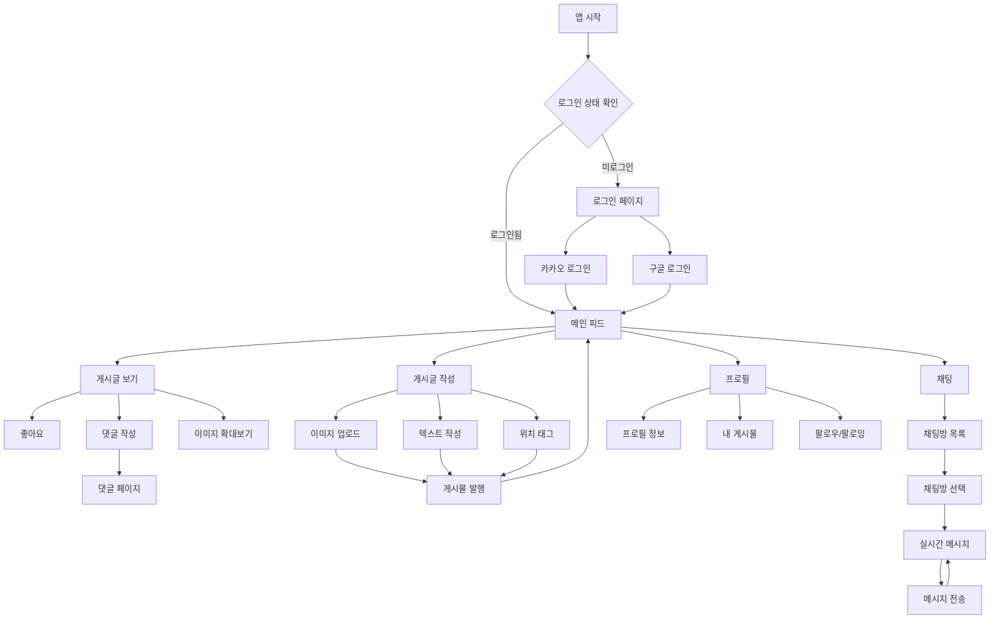

# 사용자 여정 플로우차트

## 설명

이 플로우차트는 Moment Place 앱의 사용자 여정을 보여줍니다:

1. **로그인 프로세스**: 카카오/구글 OAuth를 통한 소셜 로그인
2. **메인 기능**: 게시글 보기, 작성, 채팅, 프로필 관리
3. **상호작용**: 좋아요, 댓글, 실시간 채팅
4. **콘텐츠 생성**: 이미지 업로드, 텍스트 작성, 위치 태그